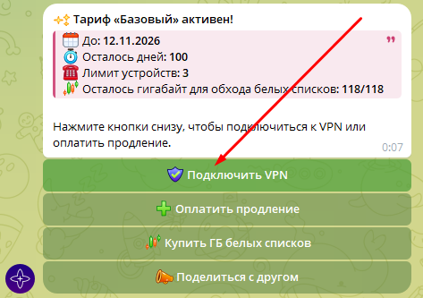

# Подключение

### Я оплатил, куда нажимать дальше, чтобы VPN заработал?

??? Info "Нажмите, чтобы посмотреть фото"
    <b>Войдите в меню.</b>

    

    <b>Нажмите кнопку VPN. Бот предоставит инструкции по подключению.</b>

    

---

### Какую локацию для подключения выбрать?
**Белые списки** — позволяет обходить региональные ограничения, когда не открывается ничего кроме ВК и Яндекса. _Трафик покупается отдельно._

**Лучшая локация** — приоритетный выбор, выбирает лучшую локацию из связок «РФ -> Зарубежная страна». Выбирайте это, если не нужна конкретная зарубежная страна.

**РФ -> Зарубежная страна** — российские сайты открываются при включённом VPN, YouTube без рекламы.

**Зарубежная страна** — обычный впн, прямое подключение к зарубежной стране. Может быть стабильнее для игр.

---

### Какое приложение для подключения использовать?
Подойдёт любой современный V2Ray-клиент, умеющий передавать HWID (ID устройства).

Например, Happ или incy. Ссылки на скачивание здесь: [Кликните](general.md/#apps)

---

### Как подключить VPN на новом устройстве?
Скопируйте вашу ссылку на VPN из бота и добавьте её в приложение на новом устройстве. Устройство добавится автоматически. Неиспользуемые устройства можно удалить через меню бота. Вы можете делиться доступом с близкими в рамках вашего лимита.

Подробнее о лимите устройств тут: [Кликните](general.md/#limit-devices)

---

### Настройка на роутере
Мы не предоставляем поддержку роутеров. При самостоятельной настройке убедитесь, что ваша программа для подключения передает HWID (ID устройства), иначе подключить не получится.

---

### Режимы Proxy и TUN на компьютере
Для браузеров рекомендуется стабильный режим **Proxy**. Режим **TUN** нужен только тогда, когда необходимо принудительно завернуть весь трафик системы в VPN. Discord также запускается именно при активном режиме **TUN**. Если режим **TUN** не работает, запустите программу от имени администратора. 

При выборе режима **TUN** выбирайте **Sing-box**, если такая настройка есть.