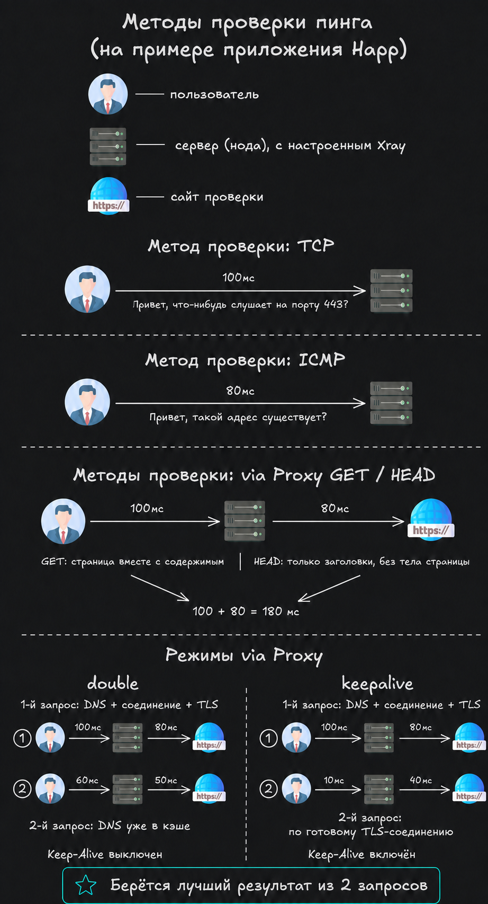

# Общие вопросы

### Что входит в тариф? {: #tariffs }

На всех тарифах доступен безлимитный VPN. Тариф также определяет лимит устройств, количество трафика для обхода
региональных ограничений «белых списков» (так называемых глушилок) и доступ к веб-прокси для Telegram.

| Тариф        | Устройства | Трафик белых списков за полную оплату 30 дней | Веб-прокси для Telegram |
|--------------|-----------:|-------------------------------------------:|------------------------|
| Базовый      |          2 |                                      30 ГБ | Не входит              |
| Оптимальный  |          6 |                                     100 ГБ | Входит                 |
| Максимальный |         15 |                                     200 ГБ | Входит                 |

!!! Info "Лимит устройств во время пробного доступа"
    На новом аккаунте пробный доступ за подписку на канал использует лимит Базового тарифа — **2 устройства**. После
    покупки платного тарифа устанавливается лимит выбранного тарифа: 2, 6 или 15 устройств. Веб-прокси в пробный доступ
    на Базовом тарифе не входит.

Обычный VPN остаётся безлимитным на любом тарифе. Гигабайты из таблицы расходуются только на локациях «Белые списки».
Дополнительный трафик можно купить отдельно. Актуальные цены всегда показываются в боте.

На Оптимальном и Максимальном тарифах веб-прокси для Telegram входит в стоимость и доступен, пока действуют дни
подписки. Отдельно покупать его не нужно. Подробнее: [Веб-прокси для Telegram](#telegram-web-proxy).

Бот позволяет выбрать 30, 90, 180 или 365 дней либо вручную ввести период от 1 до 3650 дней. Стоимость округляется вверх
до целого рубля, а включённый трафик рассчитывается пропорционально фактически оплаченной сумме. Перед оплатой бот
показывает точную цену и количество новых гигабайт.

---

### Как рассчитываются продление и смена тарифа? {: #tariff-change }

**Продление текущего тарифа.**
Неиспользованные дни сохраняются, а оплаченный срок добавляется к ним. Новые гигабайты начисляются пропорционально новой
оплате.

**Смена тарифа.**
Денежная ценность оставшегося срока не сгорает: бот пересчитывает её по цене текущего тарифа и переносит в новый.

* При переходе **без доплаты** весь оставшийся срок превращается в срок нового тарифа. На более дорогом тарифе
  календарных дней станет меньше, на более дешёвом — больше.
* При переходе **с доплатой** стоимость оставшихся дней вычитается из цены выбранного периода (итоговая цена
  уменьшается). Новые гигабайты начисляются только за фактически внесённую доплату по условиям нового тарифа.
* Уже имеющийся остаток гигабайт сохраняется при любом переходе.
* После смены начинает действовать лимит устройств нового тарифа.
* Доступ к веб-прокси тоже определяется новым тарифом: на Оптимальном и Максимальном он включается, при переходе на
  Базовый отключается. Покупка дополнительных гигабайтов белых списков не открывает доступ к веб-прокси.

Если доступ уже закончился, переносить нечего: новый тариф оплачивается как обычная покупка. Сохранённые гигабайты снова
станут доступны после возобновления подписки.

!!! Info "Почему итоговый срок иногда указан приблизительно?"
    При смене тарифа бот пересчитывает точный остаток вплоть до секунд и округляет сумму оплаты до целого рубля. Поэтому
    итоговый срок может немного отличаться от целого количества дней и отображаться со знаком «≈».

---

### Как работают бонусы? {: #bonuses }

* За подписку на канал единожды начисляется бонус, эквивалентный **3 дням Базового тарифа**, вместе с **2 ГБ** трафика
  белых списков.
* По реферальной программе приглашённый и пригласивший пользователи получают по бонусу, эквивалентному **7 дням Базового
  тарифа**. Бонус выдаётся обоим один раз после того, как приглашённый пользователь выберет и оплатит не менее 30 дней
  любого тарифа. Для участия друг должен впервые запустить бота по вашей реферальной ссылке.

«Эквивалент дней Базового тарифа» означает фиксированную ценность бонуса, а не одинаковое число календарных дней на всех
тарифах. На Базовом тарифе это будет указанное число дней, а на более дорогом — меньше календарных дней. Точный срок
покажет бот.

Бонус продлевает текущий тариф, а если доступ уже закончился — возобновляет его. Доступ к веб-прокси при этом зависит
от тарифа: на Оптимальном и Максимальном он доступен, на Базовом — нет. При смене тарифа без доплаты бонусный срок
тоже пересчитывается по стоимости нового тарифа.

После получения дней доступа в меню появляется кнопка **«Поделиться с другом»**. В этом разделе бот показывает
персональную реферальную ссылку, количество приглашённых пользователей, число купивших доступ и кнопку
**«Отправить другу»**. Ссылка сработает, только если друг впервые запустит бота именно по ней.

---

### Какие устройства поддерживаются?

Сервис работает на смартфонах и планшетах (Android, iOS), компьютерах и ноутбуках (Windows 10-11, macOS, Linux), а также
телевизорах (Android TV, Apple TV). Устаревшие ОС (например, Windows 7 или 8.1) не поддерживаются.

---

### Что такое веб-прокси для Telegram и кому он доступен? {: #telegram-web-proxy }

Веб-прокси (WEB-прокси) позволяет пользоваться Telegram без включения VPN для всего устройства. Он подключается
непосредственно в приложении Telegram; слово «веб» не означает, что нужно открывать Telegram в браузере.

Веб-прокси входит в **Оптимальный** и **Максимальный** тарифы. На **Базовом** тарифе, в том числе при пробном доступе
на новом аккаунте, он недоступен. После окончания дней подписки доступ к веб-прокси также прекращается.

Для подключения откройте **«Меню» → «ТГ-прокси»**. Раздел появляется при действующем подходящем тарифе и наличии
доступных серверов прокси. Бот покажет персональные кнопки **«Подключить»** — отдельно запрашивать доступ или покупать
его для каждого устройства не нужно. [Пошаговая инструкция](connection.md#telegram-web-proxy).

!!! Info "Для звонков и белых списков используйте VPN"
    Веб-прокси предназначен для Telegram. Для звонков в Telegram и доступа к другим приложениям используйте VPN.
    При региональных ограничениях «белых списков» подключайтесь через VPN к одноимённым локациям.

---

### Какие приложения можно использовать для подключения? {: #apps }

Для подключения мы рекомендуем использовать приложения incy или Happ. Выберите ваше устройство, кликнув на кнопку ниже.

??? Info "Android / Android TV"
    - incy: [Кликните](https://play.google.com/store/apps/details?id=llc.itdev.incy)
    - Happ: [Кликните](https://play.google.com/store/apps/details?id=com.happproxy)

    **Huawei (установка напрямую из APK, без GBox):**

    - incy APK: [Кликните](https://github.com/INCY-DEV/incy-platforms/releases/latest/download/Incy.apk)
    - Happ APK: [Кликните](https://github.com/Happ-proxy/happ-android/releases/latest/download/Happ.apk)

??? Info "iOS / macOS / AppleTV"
    ??? Danger "Регион аккаунта РФ"
        - incy: [Кликните](https://apps.apple.com/ru/app/incy/id6756943388)

    ??? Success "Регион аккаунта не РФ"
        - incy: [Кликните](https://apps.apple.com/us/app/incy/id6756943388)
        - Happ: [Кликните](https://apps.apple.com/us/app/happ-proxy-utility/id6504287215)

??? Info "Windows"
    - incy: [Кликните](https://github.com/INCY-DEV/incy-platforms/releases/latest/download/incy-windows-setup.exe)
    - Happ: [Кликните](https://github.com/Happ-proxy/happ-desktop/releases/latest/download/setup-Happ.x64.exe)

??? Info "Linux"
    - incy: [Кликните](https://github.com/INCY-DEV/incy-platforms/releases/latest)
    - Happ: [Кликните](https://github.com/Happ-proxy/happ-desktop/releases/latest)

    На странице релиза выберите пакет для своего дистрибутива и архитектуры процессора.

---

### Как работает пинг в Happ? {: #happ-ping }

Для выбора локации используйте **via Proxy → HEAD** с режимом **keepalive**. Повторите проверку несколько раз и выберите
локацию с наименьшим стабильным пингом.

**Упрощённая схема**

??? Info "Нажмите, чтобы посмотреть фото"
    { width="70%" }

**Технически точная схема**

??? Info "Нажмите, чтобы посмотреть фото"
    { width="70%" }

---

### Можно скачивать и раздавать торренты?

Для скачивания и раздачи торрентов предоставляется отдельная локация, на остальных локациях подобные соединения
разрываются в связи с соблюдением европейскими странами законов об авторском праве.

---

### Какие страны у вас есть?

Список актуальных локаций можно посмотреть в Телеграм боте. Для этого нужно нажать кнопки: Инфо → Статус серверов. Вы
увидите актуальный список зарубежных локаций и их загруженность.

---

### Насколько быстрая скорость?

Скорость соединения на стороне серверов может достигать 10 Гбит/с. Итоговая скорость зависит от устройства, провайдера,
выбранной локации и текущей нагрузки. Скорость на локациях для работы с торрентами может быть ниже.

---

### Есть ли бесплатный пробный период?

Отдельного безусловного пробного периода нет. В боте можно один раз получить бонус за подписку на канал: эквивалент 3
дней Базового тарифа и 2 ГБ трафика белых списков.

---

### Бот отправляет уведомления?

Бот заранее напоминает об окончании доступа: менее чем за 12 часов, менее чем за 1 час и после окончания. К каждому
такому уведомлению прикрепляется кнопка продления.

Во время действия доступа нажмите кнопку **«Уведомления»** в нижней клавиатуре Telegram. Там можно независимо:

* включить или выключить напоминания об окончании дней доступа;
* включить или выключить предупреждение об остатке гигабайтов белых списков;
* установить целочисленный порог от 0 до 10 000 ГБ, при достижении которого бот предложит купить дополнительный трафик.

Также бот подтверждает успешные оплаты и начисление бонусов. В редких случаях через него могут приходить важные
сервисные сообщения; новости публикуются в канале.

---

### Как продлить доступ или купить дополнительный трафик белых списков?

Нажмите **«Меню»** в нижней клавиатуре Telegram, затем выберите нужное действие:

* **«Оплатить продление»** — продлить текущий тариф или перейти на другой;
* **«Купить ГБ белых списков»** — пополнить отдельный остаток трафика.

Кнопка покупки гигабайтов доступна, пока действуют дни доступа. Неизрасходованный остаток сохраняется и после
окончания подписки, но снова использовать его можно только после продления.

---

### Есть ли ограничения по трафику?

Для обычного VPN и включённого в тариф веб-прокси трафик полностью безлимитный. Ограничение трафика действует только
для VPN-локаций «Белые списки», где трафик ограничен в зависимости от тарифа.

---

### На скольких устройствах можно использовать VPN? {: #limit-devices }

Платный Базовый тариф позволяет подключить 2 устройства, Оптимальный — 6 устройств, Максимальный — 15 устройств. Во
время пробного доступа за подписку на канал действует лимит Базового тарифа — 2 устройства. Чтобы увеличить лимит
платного доступа, перейдите на более высокий тариф.

Посмотреть список и удалить неиспользуемые устройства можно по маршруту **«Меню» → «Подключить VPN» →
«Мои устройства»**.

Для веб-прокси лимит применяется к числу одновременно используемых **IP-адресов**: по условиям тарифа это **6** на
Оптимальном и **15** на Максимальном. Учёт отличается от VPN: несколько устройств в одной сети могут использовать
один внешний IP-адрес, а одно устройство при смене сети — разные адреса. Раздел **«Мои устройства»** показывает
устройства VPN. Если ссылкой на веб-прокси пользуются посторонние, её можно
[перевыпустить в разделе «ТГ-прокси»](connection.md#web-proxy-link-update).

---

### С помощью чего можно оплачивать?

Оплатить можно с помощью СБП, российской карты, криптовалюты или Telegram Stars. Итоговую сумму для каждого способа
оплаты бот показывает до создания платежа.

!!! Warning "Оплата через Telegram Stars"
    Цена в Stars рассчитывается с учётом комиссий Telegram и может отличаться от суммы в рублях. Перед оплатой бот
    обязательно показывает точное количество Stars. Оплачивайте счёт с того же Telegram-аккаунта, в котором он был
    создан, иначе платёж будет отклонён.

---

### Как долго обрабатывается платёж? {: #payment-problem}

Обработка платежа может занимать до 5 минут. В редких случаях до 10 минут.
!!! Danger "Я жду больше 10 минут, но ничего не происходит!"
    Если средства списались, свяжитесь с поддержкой, кликнув в боте на кнопку "Поддержка". Если средства на месте —
    оплата не прошла по причинам, которые от нас не зависят (возможно, что-то связано с вашим банком), и мы не сможем на
    это повлиять.

---

### Есть ли автосписания?

Нет. Деньги без вашего прямого участия не списываются, оплата происходит только вручную.

---

### Можно ли сделать возврат средств?

Если у вас возникли нерешаемые технические сложности, которые не позволяют использовать наш сервис, мы оформим возврат.
Деньги возвращаются в течение 1-3 дней туда, откуда была произведена оплата.

!!! Success "Хочу оформить возврат!"
    Для оформления возврата свяжитесь с поддержкой, кликнув в боте на кнопку "Поддержка".

---

### Где прочитать юридические документы?

Оплачивая услуги в боте, вы соглашаетесь с
[Пользовательским соглашением](https://telegra.ph/Polzovatelskoe-soglashenie-Indy-07-14) и
[Политикой конфиденциальности](https://telegra.ph/Politika-konfidencialnosti-Indy-07-14).
