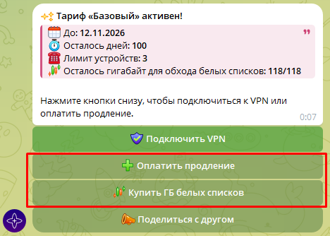

# Общие вопросы

### Что входит в тариф? {: #tariffs }

На всех тарифах доступен безлимитный VPN. Тариф также определяет лимит устройств и количество трафика для обхода региональных ограничений «белых списков» (так называемых глушилок).

| Тариф | Устройства | Трафик белых списков за полную оплату 30 дней |
| --- | ---: | ---: |
| Базовый | 3 | 30 ГБ |
| Оптимальный | 7 | 70 ГБ |
| Максимальный | 15 | 190 ГБ |

Обычный VPN остаётся безлимитным на любом тарифе. Гигабайты из таблицы расходуются только на локациях «Белые списки». Дополнительный трафик можно купить отдельно. Актуальные цены всегда показываются в боте.

Бот позволяет выбрать 30, 90, 180 или 365 дней либо вручную ввести период от 1 до 3650 дней. Стоимость округляется вверх до целого рубля, а включённый трафик рассчитывается пропорционально фактически оплаченной сумме. Перед оплатой бот показывает точную цену и количество новых гигабайт.

---

### Как рассчитываются продление и смена тарифа? {: #tariff-change }

**Продление текущего тарифа.** 
Неиспользованные дни сохраняются, а оплаченный срок добавляется к ним. Новые гигабайты начисляются пропорционально новой оплате.

**Смена тарифа.** 
Денежная ценность оставшегося срока не сгорает: бот пересчитывает её по цене текущего тарифа и переносит в новый.

* При переходе **без доплаты** весь оплаченный остаток превращается в срок нового тарифа. На более дорогом тарифе календарных дней станет меньше, на более дешёвом — больше.
* При переходе **с доплатой** стоимость оставшихся дней вычитается из цены выбранного периода (итоговая цена уменьшается). Новые гигабайты начисляются только за фактически внесённую доплату по условиям нового тарифа.
* Уже имеющийся остаток гигабайт сохраняется при любом переходе.
* После смены начинает действовать лимит устройств нового тарифа.

Если доступ уже закончился, переносить нечего: новый тариф оплачивается как обычная покупка. Сохранённые гигабайты снова станут доступны после возобновления подписки.

!!! Info "Почему итоговый срок иногда указан приблизительно?"
    При смене тарифа бот пересчитывает точный остаток вплоть до секунд и округляет сумму оплаты до целого рубля. Поэтому итоговый срок может немного отличаться от целого количества дней и отображаться со знаком «≈».

---

### Как работают бонусы? {: #bonuses }

* За подписку на канал единожды начисляется бонус, эквивалентный **3 дням Базового тарифа**, вместе с **2 ГБ** трафика белых списков.
* По реферальной программе приглашённый и пригласивший пользователи получают по бонусу, эквивалентному **7 дням Базового тарифа**. Бонус выдаётся обоим один раз после того, как приглашённый пользователь купит 30 дней любого тарифа. Для участия друг должен впервые запустить бота по вашей реферальной ссылке.

«Эквивалент дней Базового тарифа» означает фиксированную ценность бонуса, а не одинаковое число календарных дней на всех тарифах. На Базовом тарифе это будет указанное число дней, а на более дорогом — меньше календарных дней. Точный срок покажет бот.

---

### Какие устройства поддерживаются?

Сервис работает на смартфонах и планшетах (Android, iOS), компьютерах и ноутбуках (Windows 10-11, macOS, Linux), а также
телевизорах (Android TV, Apple TV). Устаревшие ОС (например, Windows 7 или 8.1) не поддерживаются.

---

### Какие приложения можно использовать для подключения? {: #apps }

Для подключения мы рекомендуем использовать приложения incy или Happ. Выберите ваше устройство, кликнув на кнопку ниже.

??? Info "Android / Android TV"
    - incy: [Кликните](https://play.google.com/store/apps/details?id=llc.itdev.incy)
    - Happ: [Кликните](https://play.google.com/store/apps/details?id=com.happproxy)

??? Info "iOS / macOS / AppleTV"
    ??? Danger "Регион аккаунта РФ"
        - incy: [Кликните](https://apps.apple.com/ru/app/incy/id6756943388)

    ??? Success "Регион аккаунта не РФ"
        - incy: [Кликните](https://apps.apple.com/us/app/incy/id6756943388)
        - Happ: [Кликните](https://apps.apple.com/us/app/happ-proxy-utility/id6504287215)

??? Info "Windows"
    - incy: [Кликните](https://github.com/INCY-DEV/incy-platforms/releases/download/desktop-v3.3.0/incy-windows-setup.exe)
    - Happ: [Кликните](https://github.com/Happ-proxy/happ-desktop/releases/latest/download/setup-Happ.x64.exe)

---

### Можно скачивать и раздавать торренты?
Для скачивания и раздачи торрентов предоставляется отдельная локация, на остальных локациях подобные соединения разрываются в связи с соблюдением европейскими странами законов об авторском праве.

---

### Какие страны у вас есть?

Список актуальных локаций можно посмотреть в Телеграм боте. Для этого нужно нажать кнопки: Инфо → Статус серверов. Вы
увидите актуальный список зарубежных локаций и их загруженность.

---

### Насколько быстрая скорость?

Скорость соединения на стороне серверов может достигать 10 Гбит/с. Итоговая скорость зависит от устройства, провайдера, выбранной локации и текущей нагрузки. Скорость на локациях для работы с торрентами может быть ниже.

---

### Есть ли бесплатный пробный период?

Отдельного безусловного пробного периода нет. В боте можно один раз получить бонус за подписку на канал: эквивалент 3 дней Базового тарифа и 2 ГБ трафика белых списков.

---

### Бот отправляет уведомления?
Бот заранее напоминает об окончании доступа: менее чем за 12 часов, менее чем за 1 час и после окончания. К каждому такому уведомлению прикрепляется кнопка продления.

Также бот подтверждает успешные оплаты и начисление бонусов. В редких случаях через него могут приходить важные сервисные сообщения; новости публикуются в канале.

---

### Как продлить доступ или купить дополнительный трафик белых списков?
??? Info "Нажмите, чтобы посмотреть фото"
    <b>Войдите в меню.</b>

    

    <b>Затем используйте соответствующие кнопки.</b>
    
    

---

### Есть ли ограничения по трафику?

Для обычного VPN трафик полностью безлимитный. Ограничение трафика действует только для локаций «Белые
списки», где трафик ограничен в зависимости от тарифа.

---

### На скольких устройствах можно использовать VPN? {: #limit-devices }

Базовый тариф позволяет подключить 3 устройства, Оптимальный — 7 устройств, Максимальный — 15 устройств. Чтобы увеличить лимит, перейдите на более высокий тариф.

---

### С помощью чего можно оплачивать?

Оплатить можно с помощью СБП, российской карты, криптовалюты или Telegram Stars. Итоговую сумму для каждого способа оплаты бот показывает до создания платежа.

---

### Как долго обрабатывается платёж? {: #payment-problem}

Обработка платежа может занимать до 5 минут. В редких случаях до 10 минут.
!!! Danger "Я жду больше 10 минут, но ничего не происходит!"
    Если средства списались, свяжитесь с поддержкой, кликнув в боте на кнопку "Поддержка". Если средства на месте — оплата
    не прошла по причинам, которые от нас не зависят (возможно, что-то связано с вашим банком), и мы не сможем на это
    повлиять.

---

### Есть ли автосписания?

Нет. Деньги без вашего прямого участия не списываются, оплата происходит только вручную.

---

### Можно ли сделать возврат средств?

Если у вас возникли нерешаемые технические сложности, которые не позволяют использовать наш сервис, мы оформим возврат.
Деньги возвращаются в течение 1-3 дней туда, откуда была произведена оплата.

!!! Success "Хочу оформить возврат!"
    Для оформления возврата свяжитесь с поддержкой, кликнув в боте на кнопку "Поддержка".
