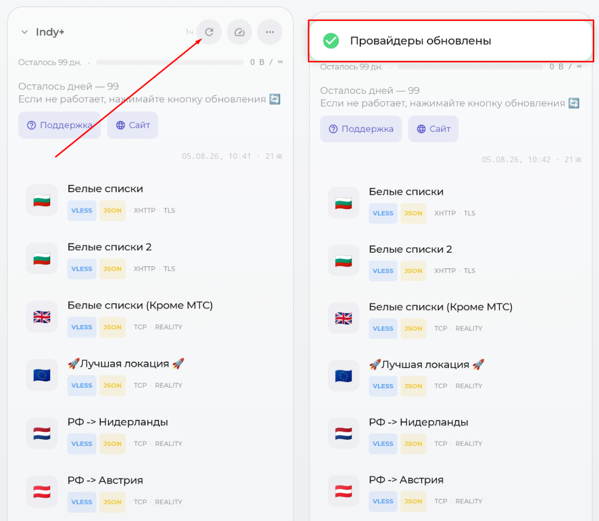
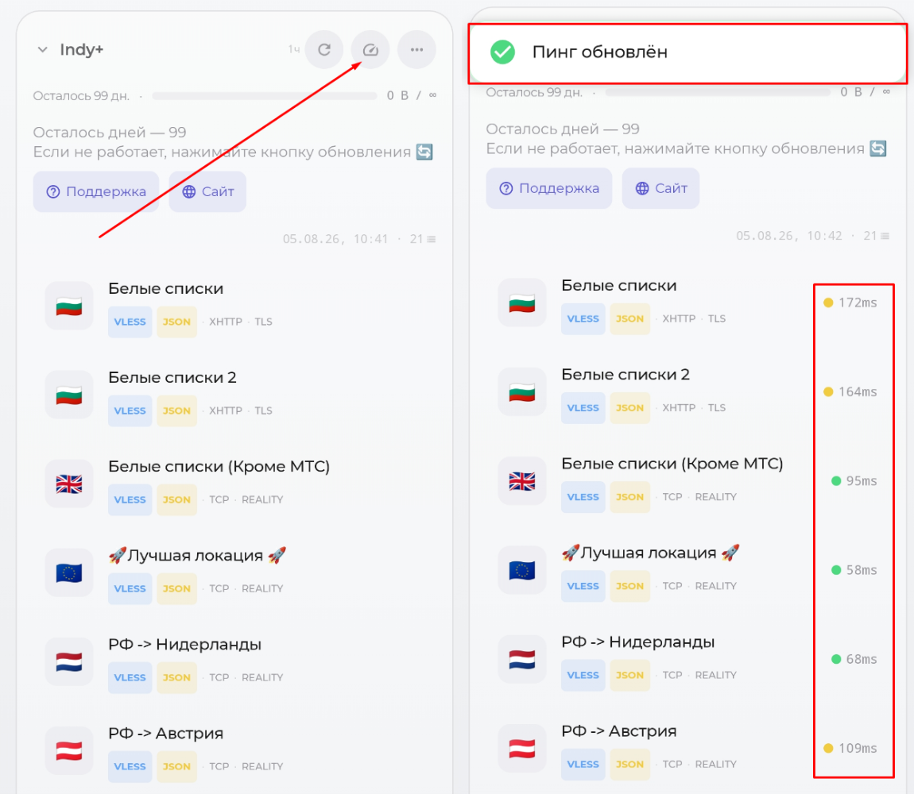
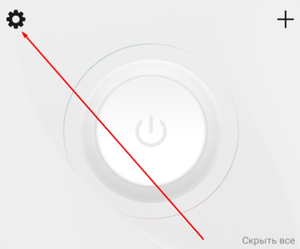

# Решение проблем

### Не добавляется ссылка в приложение (нет локаций для подключения) / Не обновляется по кнопке

1. Установите актуальную версию программы, через которую выполняется подключение (Happ, incy и др.)
2. Отключите другие VPN-приложения (если обновляете ссылку, есть смысл выключить VPN и в активном приложении)
3. Смените сеть (с мобильного интернета на Wi-Fi или наоборот).
4. Если у вас Android, проверьте в настройках, выключен ли частный DNS-сервер.
    
    ??? Info "Нажмите, чтобы посмотреть фото"
        <b>Найдите этот пункт в настройках телефона. Обычно его можно найти через поиск.</b>
        { width="50%" }
        { width="50%" }

5. Попробуйте альтернативное приложение (например, incy вместо Happ).

---

### VPN подключён, но не работает (или все локации н/д) {: #vpn-not-working }
1. Проверьте, не используете ли вы программы типа Torrent (или иные, которые могут скачивать или раздавать файлы по протоколу BitTorrent). Для скачивания и раздачи торрентов предоставляется отдельная локация, на остальных локациях подобные соединения разрываются в связи с соблюдением европейскими странами законов об авторском праве. 
2. Установите актуальную версию программы, через которую выполняется подключение (Happ, incy и др.)
3. Нажмите кнопку обновления в приложении. Локации также обновляются автоматически раз в час, но ручное обновление
   позволяет сразу получить актуальную конфигурацию.
    
    ??? Info "Нажмите, чтобы посмотреть фото"
        { width="70%" }

4. Проверьте пинг в приложении. Подключайтесь к серверу, где появились числа.

    ??? Info "Нажмите, чтобы посмотреть фото"
        <b>На скриншоте приложение incy, но аналогичным образом пинг проверяется и в других приложениях для подключения.</b>
        { width="70%" }

5. Если у вас Android, проверьте в настройках, выключен ли частный DNS-сервер.
    
    ??? Info "Нажмите, чтобы посмотреть фото"
        <b>Найдите этот пункт в настройках телефона. Обычно его можно найти через поиск.</b> 
        { width="50%" }
        { width="50%" }

6. Проверьте доступность интернета без VPN. Если не загружается, например, Google, значит, в вашем регионе могут действовать «белые списки». Используйте одноимённую локацию: трафик для неё уже входит в каждый тариф, а при необходимости его можно докупить. Подробнее: [Кликните](whitelist.md#about-whitelist)
7. Проверьте скорость своего интернета без VPN. Возможно, он медленный сам по себе: [Кликните](https://yandex.ru/internet/)
8. Если используете Happ, проверьте настройки приложения и отключите лишние ползунки (или используйте другое приложение, например, incy). Если принципиально использование Happ, используйте кнопку сброса в настройках приложения (нужно будет заново добавлять ссылки).

    ??? Info "Нажмите, чтобы посмотреть фото"
        { width="40%" }

        { width="50%" }

9. Отключите сторонние программы для обхода блокировок (GoodbyeDPI/zapret), если они есть. Они могут конфликтовать с VPN.
10. Попробуйте альтернативное приложение (например, incy вместо Happ).

---

### В Happ нет «Лучшей локации» и пометки JSON {: #happ-user-agent }

Если в Happ одновременно отсутствуют локация **«Лучшая локация»** и пометка **JSON**, причина обычно в заданном вручную
значении **User-Agent**.

1. Откройте **Happ → Настройки → Подписки** и выберите нужную подписку.
2. Полностью очистите поле **User-Agent**: оно должно быть пустым, без пробелов и других значений.
3. Сохраните изменения, затем обновите подписку и список локаций.

Если это не помогло, сбросьте настройки Happ и заново добавьте персональную ссылку из бота. После сброса другие настройки
приложения тоже потребуется задать заново.

Также можно воспользоваться приложением **incy.**

---

### Высокий пинг в приложении

В Happ выберите **via Proxy → HEAD** с режимом **keepalive**, затем повторите проверку несколько раз. Выбирайте локацию с
наименьшим стабильным пингом.

Подробнее о способе проверки и схемы: [Кликните](general.md#happ-ping).

---

### Достиг лимита устройств

Вы можете перейти в бота и удалить неиспользуемые устройства — одно или сразу все. После этого снова добавятся только
те устройства, на которых вы подключитесь к VPN. Маршрут: **«Меню» → «Подключить VPN» → «Мои устройства»**.

Если устройств всё равно не хватает, выберите платный тариф с более высоким лимитом: Базовый поддерживает 2 устройства,
Оптимальный — 6, Максимальный — 15. На новом аккаунте во время пробного доступа за подписку на канал также доступно
2 устройства.

---

### Российские <u>приложения</u> просят выключить VPN

Сначала подключитесь к локации **«Лучшая локация»**. Если приложение всё равно просит выключить VPN, настройте обход,
как показано на скриншоте. В примере приложение Happ, но похожим образом всё настраивается и в других подобных приложениях.

!!! Warning "Ограничение на устройствах Apple"
    Раздельный обход приложений недоступен на iPhone, iPad, Mac и Apple TV.

??? Info "Нажмите, чтобы посмотреть фото"
    { width="40%" }
    { width="70%" }

---

### Не работает VPN на устройстве Huawei

На устройствах Huawei установите Happ или incy напрямую из APK. Официальные прямые загрузки находятся в разделе
приложений: [Кликните](general.md#apps). **Не устанавливайте и не запускайте Happ или incy через GBox:** в таком варианте
VPN-подключение работать не будет.

После прямой установки откройте обычную инструкцию подключения: [Кликните](connection.md#first-connection).

---

### Российские <u>сайты</u> просят выключить VPN

Подключитесь к локации **«Лучшая локация»** или **«РФ → Зарубеж»**.

---

### YouTube показывает рекламу

Подключитесь к локации **«РФ → Зарубеж»** или попробуйте другую обычную локацию.

---

### Не хватает стабильности в играх

В первую очередь подключайтесь к локациям, отмеченным как игровые. Если таких локаций нет или они не работают,
подключитесь к ближайшей к вам обычной локации.

---

### Не работает конкретный сервис (ChatGPT, YouTube, Telegram).

Причины проблем с доступностью могут быть разные. Обычно помогает смена локации и перезапуск нужного приложения или сайта.

---

### Если не открывается Gemini

#### Ошибка «Подозрительный трафик»

Если появляется сообщение:

> Мы зарегистрировали подозрительный трафик, исходящий из вашей сети. Повторите запрос позднее.

1. Полностью закройте вкладку с Gemini — простого обновления страницы недостаточно.
2. По возможности смените VPN-локацию.
3. Снова откройте сайт Gemini.

#### Gemini недоступен в вашем регионе

Если Gemini сообщает, что сервис недоступен в текущем регионе:

1. Смените VPN-локацию.
2. Обновите страницу.

В этом случае закрывать вкладку не требуется.

---

### Если TikTok показывает только старые видео на iPhone

Выполняйте действия по порядку и остановитесь, когда свежие видео появятся.

*Нажмите на кнопки ниже, чтобы открыть порядок действий.*

??? Info "1. Простая проверка"
    1. Полностью закройте TikTok.
    2. Подключите VPN.
    3. Откройте TikTok только после подключения VPN.
    4. Попробуйте другую VPN-локацию.
    5. В Happ отключите маршрутизацию в настройках приложения, затем обновите приложение и список серверов.
    6. Попробуйте incy вместо Happ.
    7. Очистите кэш TikTok:

        `TikTok → Профиль → ☰ → Настройки и конфиденциальность → Освободить место → Кэш → Очистить`

    8. Перезапустите TikTok и iPhone. Проверьте наличие обновлений TikTok и iOS.

??? Info "2. Отключение геолокации и SIM"
    1. Запретите TikTok доступ к геолокации:

        `Настройки iPhone → Конфиденциальность и безопасность → Службы геолокации → TikTok → Никогда`

    2. Если в TikTok есть раздел геолокации, удалите сохранённые данные о местоположении.
    3. Полностью закройте TikTok.
    4. Извлеките физическую SIM-карту или временно отключите линию eSIM. **Не удаляйте саму eSIM.**
    5. Включите авиарежим, затем отдельно включите Wi-Fi.
    6. Подключите VPN и откройте TikTok.

??? Info "3. Чистая переустановка"
    !!! warning "Сохраните черновики"
        Перед началом сохраните черновики на устройство или опубликуйте их с видимостью «Только вы». После удаления TikTok
        черновики могут исчезнуть.

    1. Временно установите английский язык и регион страны выбранной VPN-локации:

        `Настройки → Основные → Язык и регион`

    2. Отключите геолокацию для TikTok и SIM/eSIM.
    3. Включите авиарежим, затем Wi-Fi и VPN.
    4. Полностью удалите TikTok — выберите **«Удалить приложение»**, а не **«Выгрузить приложение»**.
    5. Перезагрузите iPhone.
    6. Снова включите Wi-Fi и VPN.
    7. Установите TikTok из App Store.
    8. В первый раз откройте TikTok только при подключённом VPN и отключённой SIM.
    9. Не разрешайте приложению доступ к геолокации.
    10. Сначала проверьте свежие видео без входа в аккаунт, затем войдите в свой аккаунт.

    Если всё заработало, сначала верните прежние язык и регион и снова проверьте TikTok. Затем включите SIM и проверьте
    ещё раз.

??? Info "4. Если не помогло"
    Проверьте:

    - другой TikTok-аккаунт на том же iPhone;
    - основной аккаунт на другом iPhone;
    - TikTok без входа через приватную вкладку Safari при включённом VPN.

    Если другой аккаунт работает, проблема связана с основным аккаунтом. В этом случае обратитесь в поддержку TikTok или
    используйте новый аккаунт.

    Если браузерная версия работает, её можно использовать как альтернативу:

    `Safari → tiktok.com → Поделиться → На экран «Домой»`

    Если свежие видео открываются по прямым ссылкам, но лента «Для вас» остаётся старой:

    `Настройки TikTok → Предпочитаемый контент → Обновить ленту «Для вас»`

    Полный сброс iPhone, модифицированные версии TikTok и неизвестные IPA-файлы использовать не рекомендуется.

---

### Нет кнопки «ТГ-прокси» или раздел недоступен {: #web-proxy-unavailable }

1. Проверьте текущий тариф в **«Меню»**. Веб-прокси входит только в **Оптимальный** и **Максимальный** тарифы.
   На Базовом, в том числе при пробном доступе на новом аккаунте, этой кнопки нет.
2. Убедитесь, что дни подписки не закончились. Для продления или смены тарифа нажмите **«Оплатить продление»**.
3. После продления или смены тарифа заново откройте **«Меню» → «ТГ-прокси»**.

Если подходящий тариф действует, а кнопки по-прежнему нет, бот пишет **«Раздел временно недоступен»** или не показывает
кнопки **«Подключить»**, обратитесь в поддержку. Наличие раздела также зависит от доступных серверов прокси.
До восстановления используйте VPN.

---

### Веб-прокси не подключается или работает нестабильно {: #web-proxy-not-working }

1. Обновите Telegram. Если ссылка из кнопки **«Подключить»** не открывается, убедитесь, что используете приложение
   с поддержкой WEB-прокси. Если ваш клиент этот формат не поддерживает, используйте VPN.
2. Проверьте действующий тариф и срок доступа в боте. На Базовом тарифе и после окончания подписки веб-прокси недоступен.
3. Если вы обновляли ссылки в боте, удалите старые записи прокси из Telegram и подключитесь по новым кнопкам.
4. Если бот предлагает несколько веб-прокси, выберите другой в настройках Telegram. При наличии настройки
   **«Автопереключение прокси»** можно включить её.
5. Попробуйте другую сеть: Wi-Fi вместо мобильного интернета или наоборот.
6. Если ссылкой пользуются посторонние или есть подозрение на превышение лимита, отключите лишние подключения и при
   необходимости [обновите ссылки в боте](connection.md#web-proxy-link-update).

Для звонков в Telegram используйте VPN. Если в сети действуют «белые списки», подключайтесь к соответствующей
VPN-локации. Если веб-прокси всё равно не работает, используйте VPN и обратитесь в поддержку.

---

### Спустя время отключается VPN на iOS

Возможно, дело в лимите памяти, который выделяется на работающее приложение системой. Установите приложение incy. В нём есть специальная функция: Настройки > Расширенные настройки > Режим No Limit. Там же в настройках можно включить, чтобы в приложении incy на главном экране было видно, сколько памяти тратится. 
??? Info "Нажмите, чтобы посмотреть фото"
    { width="60%" }

Также были случаи, когда помогало обновить iOS до актуальной версии. Если вы этого ещё не сделали, желательно обновиться.

---

### Проблемы с оплатой
Решение проблем с оплатой описано здесь: [Кликните](general.md#payment-problem)
